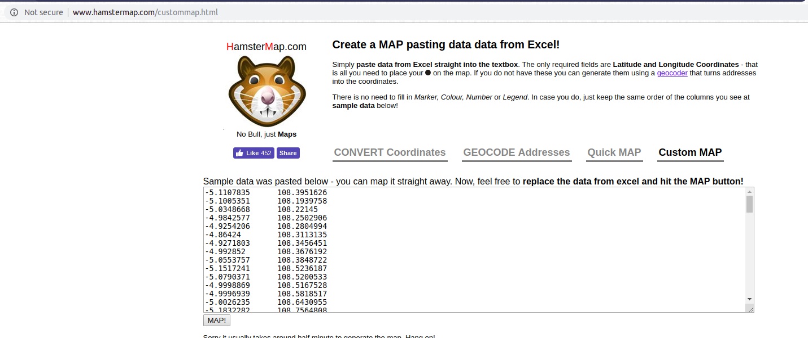
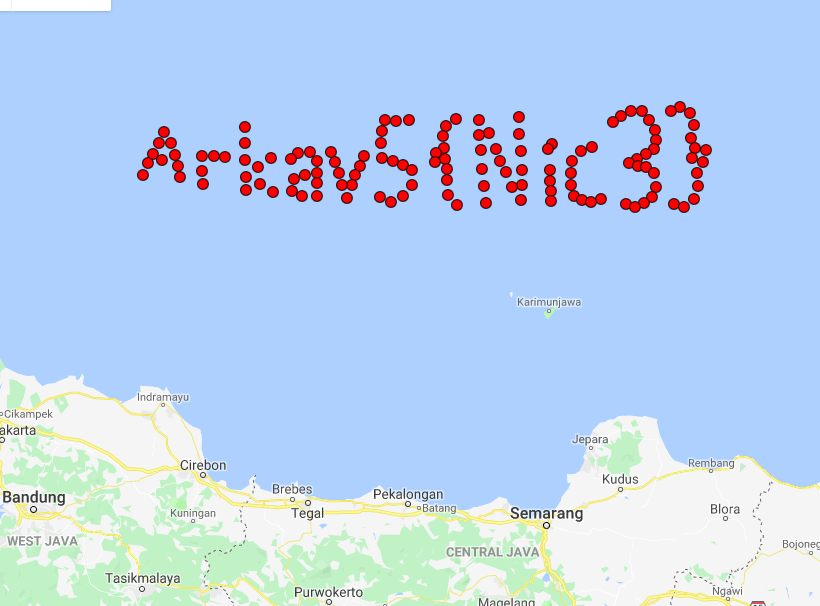

# Dora [Medium]

## File

Upload file [data.zip](data.zip).

## Solve

Extract file `data.zip`. Folder `out` terdiri dari 133 file gambar yang mirip. Perbedaanya hanya pada bagian tag GPS. terdapat 133 tag GPS yang berbeda. ketika semua GPS di pin pada maps, maka akan membentuk sebuah tulisan yaitu flag.

## PoC

Get GPS

```py
import os

for i in range(133):
    # https://github.com/bennoleslie/pexif
    os.system('python scripts/getgps.py out/' + str(i+1) + '.jpg')
```

Check



Flag



## Flag
`Arkav5{Nic3}`